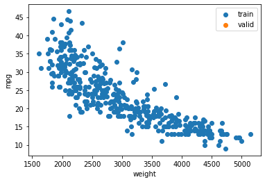
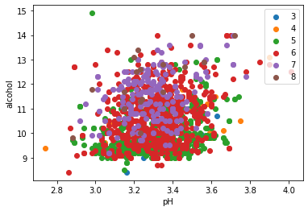
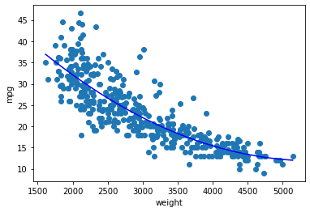
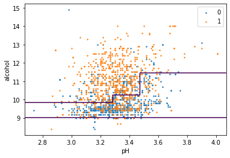

# PipeTorch Data module

The most common way to prepare data is to use Pandas DataFrame, however, data preparation and visualization can be very repetitive. Therefore, we designed an extension to a Pandas DataFrame (called a DFrame), that adds a quick way to do the most common data preprocessing, preparation and visualization.

The additional functions are divided in:
- [Data loading](#Data-Loading)
- [Out-of-sample validation](#Out-of-sample-validation): [split()](#split()) and [folds()](#folds())
- [Preprocessing](#Data-preprocessing): [scale()](#Scale()), [balance()](#Balance()), [polynomials()](#polynomials()), [category()](#category()), [dummies()](#dummies())
- [Visualization](#Visualization): [scatter()](#scatter()), [scatter2d_class()](#scatter2d_class()), [line()](#line()), and [plot_boundary()](#plot_boundary())
- [Data preparation](#Data-preparation): to [Numpy](#Numpy-Array) or a PyTorch [DataSet](#DataLoader), [DataLoader](#DataLoader) or PipeTorch [Databunch](#DataLoader)

Two important things about the way the PipeTorch data pipeline works:
- all operations are `lazily executed`; e.g. scaling is not done until the data preparation is called. A dataframe `df` therefore still shows the original data while `df.train_X` shows the result after splitting and scaling.
- therefore, a call to any data preparation should come last, the order of the other functions is irrevelant.
- all PipeTorch operations are `non-destructive`, i.e. calling a function on a DataFrame `df` will not alter `df` but return a new version that is configured accordingly. There is one exception, when any data preparation function is called, the exact data split is stored to allow subsequent actions to consistently work with the same data.

We will provide some examples below, for more explanations and advanced options you can check the docstring for these functions (e.g. ?df.split).


```python
from pipetorch.data import DFrame, create_kaggle_authentication
import matplotlib.pyplot as plt
import numpy as np
```

    using gpu 3


# Data Loading

The data pipeline often starts by loading a dataset. The most basic way is to use [read_csv](#read_csv) to . Kaggle is a great resource for these, therefore, there is also a [read_from_kaggle](#read_from_kaggle) function to download a dataset directly from Kaggle.

### read_csv()

Uses pd.read_csv to read a csv from file or url. The difference with Pandas is that a DFrame is returned and it allows downloaded files to be automatically stored with `save=True` in `path / filename`, so that when read_csv is called with the same parameters the stored file is used. The `kwargs` are passed to pd.read_csv. When a (multichar) delimiter is used, this is also used to save the file so that the original delimiter is kept.

``` 
Args:

    url: str
        the url to download or a full path pointing to a .csv file
        
    filename: str (None)
        the filename to store the downloaded file under. If None, the filename is extracted from the url.
        
    path: str (None)
        the path in which the file is stored. If None, it will first check the ~/.pipetorch (for sharing
        dataset between users) and then ~/.pipetorchuser (for user specific caching of datasets).
        
    save: bool (False)
        whether to save a downloaded .csv
        
    **kwargs:
        additional parameters passed to pd.read_csv. For example, when a multichar delimiter is used
        you will have to set engine='python'.

Returns: DFrame
```


```python
wine = DFrame.read_csv('https://osf.io/8fwaj/download')
wine
```

    Downloading https://osf.io/8fwaj/download


<div>
<style scoped>
    .dataframe tbody tr th:only-of-type {
        vertical-align: middle;
    }

    .dataframe tbody tr th {
        vertical-align: top;
    }

    .dataframe thead th {
        text-align: right;
    }
</style>
<table border="1" class="dataframe">
  <thead>
    <tr style="text-align: right;">
      <th></th>
      <th>quality</th>
      <th>pH</th>
      <th>volatile acidity</th>
      <th>alcohol</th>
    </tr>
  </thead>
  <tbody>
    <tr>
      <th>0</th>
      <td>5</td>
      <td>3.51</td>
      <td>0.700</td>
      <td>9.4</td>
    </tr>
    <tr>
      <th>1</th>
      <td>5</td>
      <td>3.20</td>
      <td>0.880</td>
      <td>9.8</td>
    </tr>
    <tr>
      <th>2</th>
      <td>5</td>
      <td>3.26</td>
      <td>0.760</td>
      <td>9.8</td>
    </tr>
    <tr>
      <th>3</th>
      <td>6</td>
      <td>3.16</td>
      <td>0.280</td>
      <td>9.8</td>
    </tr>
    <tr>
      <th>4</th>
      <td>5</td>
      <td>3.51</td>
      <td>0.700</td>
      <td>9.4</td>
    </tr>
    <tr>
      <th>...</th>
      <td>...</td>
      <td>...</td>
      <td>...</td>
      <td>...</td>
    </tr>
    <tr>
      <th>1594</th>
      <td>5</td>
      <td>3.45</td>
      <td>0.600</td>
      <td>10.5</td>
    </tr>
    <tr>
      <th>1595</th>
      <td>6</td>
      <td>3.52</td>
      <td>0.550</td>
      <td>11.2</td>
    </tr>
    <tr>
      <th>1596</th>
      <td>6</td>
      <td>3.42</td>
      <td>0.510</td>
      <td>11.0</td>
    </tr>
    <tr>
      <th>1597</th>
      <td>5</td>
      <td>3.57</td>
      <td>0.645</td>
      <td>10.2</td>
    </tr>
    <tr>
      <th>1598</th>
      <td>6</td>
      <td>3.39</td>
      <td>0.310</td>
      <td>11.0</td>
    </tr>
  </tbody>
</table>
<p>1599 rows × 4 columns</p>
</div>


### read_from_kaggle()

Reads a DFrame from a Kaggle dataset. The downloaded dataset is automatically stored so that the next time it is read from file rather than downloaded. See `read_csv`. The dataset is stored by default in a folder with the dataset name in `~/.pipetorchuser`.

If the dataset is not cached, this functions requires a valid .kaggle/kaggle.json file, that you can create manually or with the function `create_kaggle_authentication()`.

Note: there is a difference between a Kaggle dataset and a Kaggle competition. For the latter, you have to use `read_from_kaggle_competition`.
    
```
Args:

    dataset: str
        the username/dataset part of the kaggle url, e.g. uciml/autompg-dataset  
        
    train: str (None)
        the filename that is used as the train set, e.g. 'train.csv'

    test: str (None)
        the filename that is used as the test set, e.g. 'test.csv'. Although the test set is added to the
        DFrame, PipeTorch ensures that these rows are assigned to the test set when preparing data and
        that no test information leaks through the PipeTorch functions (like scale, dummies, etc.)
        
    shared: bool (False)
        save the dataset in ~/.pipetorch instead of ~/.pipetorchuser, allowing to share downloaded
        files between users.
        
    force: bool (False)
        when True, the dataset is always downloaded
        
    **kwargs:
        additional parameters passed to pd.read_csv. For example, when a multichar delimiter is used
        you will have to set engine='python'.

Returns: DFrame
```

Note: if you want to be able to download yourself, register an account at Kaggle (free), create a token on their website and register the token on your machine in `~/.kaggle/kaggle.json` or through the function below (only tested on Ubuntu).


```python
# create_kaggle_authentication('username', 'tokenstring')
```

To read/download `https://www.kaggle.com/datasets/uciml/autompg-dataset`


```python
mpg = DFrame.read_from_kaggle('uciml/autompg-dataset') 
```

To read a dataset that has separate train and test set into a single DFrame


```python
occupancy = DFrame.read_from_kaggle('robmarkcole/occupancy-detection-data-set-uci', 'datatraining.txt', 'datatest.txt')
```

# DataFrame

The returned object is an extension of a Pandas DataFrame (called a DFrame). This means you can use Pandas for cleaning the data. One convenient function we added is `inspect()` to get an overview of the data.


```python
mpg = DFrame.read_from_kaggle('uciml/autompg-dataset') 
mpg.drop(columns='cylinders').head(5)
```


<div>
<style scoped>
    .dataframe tbody tr th:only-of-type {
        vertical-align: middle;
    }

    .dataframe tbody tr th {
        vertical-align: top;
    }

    .dataframe thead th {
        text-align: right;
    }
</style>
<table border="1" class="dataframe">
  <thead>
    <tr style="text-align: right;">
      <th></th>
      <th>mpg</th>
      <th>displacement</th>
      <th>horsepower</th>
      <th>weight</th>
      <th>acceleration</th>
      <th>model year</th>
      <th>origin</th>
      <th>car name</th>
    </tr>
  </thead>
  <tbody>
    <tr>
      <th>0</th>
      <td>18.0</td>
      <td>307.0</td>
      <td>130</td>
      <td>3504</td>
      <td>12.0</td>
      <td>70</td>
      <td>1</td>
      <td>chevrolet chevelle malibu</td>
    </tr>
    <tr>
      <th>1</th>
      <td>15.0</td>
      <td>350.0</td>
      <td>165</td>
      <td>3693</td>
      <td>11.5</td>
      <td>70</td>
      <td>1</td>
      <td>buick skylark 320</td>
    </tr>
    <tr>
      <th>2</th>
      <td>18.0</td>
      <td>318.0</td>
      <td>150</td>
      <td>3436</td>
      <td>11.0</td>
      <td>70</td>
      <td>1</td>
      <td>plymouth satellite</td>
    </tr>
    <tr>
      <th>3</th>
      <td>16.0</td>
      <td>304.0</td>
      <td>150</td>
      <td>3433</td>
      <td>12.0</td>
      <td>70</td>
      <td>1</td>
      <td>amc rebel sst</td>
    </tr>
    <tr>
      <th>4</th>
      <td>17.0</td>
      <td>302.0</td>
      <td>140</td>
      <td>3449</td>
      <td>10.5</td>
      <td>70</td>
      <td>1</td>
      <td>ford torino</td>
    </tr>
  </tbody>
</table>
</div>


```python
mpg.inspect()
```


<div>
<style scoped>
    .dataframe tbody tr th:only-of-type {
        vertical-align: middle;
    }

    .dataframe tbody tr th {
        vertical-align: top;
    }

    .dataframe thead th {
        text-align: right;
    }
</style>
<table border="1" class="dataframe">
  <thead>
    <tr style="text-align: right;">
      <th></th>
      <th>Missing (#)</th>
      <th>Missing (%)</th>
      <th>Datatype</th>
      <th>Range</th>
      <th>Values</th>
    </tr>
  </thead>
  <tbody>
    <tr>
      <th>mpg</th>
      <td>0</td>
      <td>0.0</td>
      <td>float64</td>
      <td>[9.0, 46.6]</td>
      <td>(13.0, 14.0, ...)</td>
    </tr>
    <tr>
      <th>cylinders</th>
      <td>0</td>
      <td>0.0</td>
      <td>int64</td>
      <td>[3, 8]</td>
      <td>(4, 8, ...)</td>
    </tr>
    <tr>
      <th>displacement</th>
      <td>0</td>
      <td>0.0</td>
      <td>float64</td>
      <td>[68.0, 455.0]</td>
      <td>(97.0, 98.0, ...)</td>
    </tr>
    <tr>
      <th>horsepower</th>
      <td>0</td>
      <td>0.0</td>
      <td>object</td>
      <td>#94</td>
      <td>(150, 90, ...)</td>
    </tr>
    <tr>
      <th>weight</th>
      <td>0</td>
      <td>0.0</td>
      <td>int64</td>
      <td>[1613, 5140]</td>
      <td>(1985, 2130, ...)</td>
    </tr>
    <tr>
      <th>acceleration</th>
      <td>0</td>
      <td>0.0</td>
      <td>float64</td>
      <td>[8.0, 24.8]</td>
      <td>(14.5, 15.5, ...)</td>
    </tr>
    <tr>
      <th>model year</th>
      <td>0</td>
      <td>0.0</td>
      <td>int64</td>
      <td>[70, 82]</td>
      <td>(73, 78, ...)</td>
    </tr>
    <tr>
      <th>origin</th>
      <td>0</td>
      <td>0.0</td>
      <td>int64</td>
      <td>[1, 3]</td>
      <td>(1, 3, ...)</td>
    </tr>
    <tr>
      <th>car name</th>
      <td>0</td>
      <td>0.0</td>
      <td>object</td>
      <td>#305</td>
      <td>(ford pinto, toyota corolla, ...)</td>
    </tr>
  </tbody>
</table>
</div>


# Out-of-sample validation

For Machine Learning, you have to use out-of-sample validation and test sets. PipeTorch provides two easy functions to do that:

### folds()

Divide the data over n folds to setup n-Fold Cross Validation in a reproducible manner. 
        
By combining folds() with split(0 < test_size < 1) , a single testset is split before dividing the remainder in folds that are used for training and validation. When used without split, by default a single fold is used for testing.

The folds assigned to the validation and test-set rotate differently, giving 5x4 combinations for 5-fold cross validation. You can apply exhaustive cross-validation over all 20 combinations by calling fold(0) through fold(19), or less exhaustive cross-validation by calling fold(0) through fold(4) to use every fold for validation and testing once. 

```
Arguments:

    folds: int (None)
        The number of times the data will be split in preparation for n-fold cross validation. The
        different splits can be used through the fold(n) method.
        SKLearn's SplitShuffle is used, therefore no guarantee is given that the splits are
        different nor that the validation splits are disjoint. For large datasets, that should not
        be a problem.
        
    shuffle: bool (None)
        shuffle the rows before splitting. None means True unless sequence() is called to process
        the data as a (time) series.
        
    random_state: int (None)
        set a random_state for reproducible results
        
    stratify: str or [ str ] (None)
        uses the iterative-stratification library to apply stratified sampling. Per value for the given column,
        the rows are sampled. When a list of columns is given, multi-label stratification is applied.
        
    test: bool (None)
        whether to use one fold as a test set. The default None is interpreted as True when
        split is not used. Often for automated n-fold cross validation studies, the validation set
        is used for early termination, and therefore you should use an out-of-sample
        test set that was not used for optimizing.

Returns: copy of DFrame 
    schedules the data to be split in folds.
```

The example below creates 5 equally sized folds. Calls to df.fold(i) will set the train/valid/test sets to one of the permutations over the folds. The sets are generated when data preparation is called, e.g. df.train, df.valid or df.test. Using folds ensures that no data from the valid/test part is used in training or leaked, and that there is no overlap between resp. the train/test part over the different folds.


```python
wine = DFrame.read_csv('https://osf.io/8fwaj/download')
wine = wine.folds(5)
for i in range(5):
    print(wine.fold(i).valid.head(2))
```

    Downloading https://osf.io/8fwaj/download
       quality    pH  volatile acidity  alcohol
    1        5  3.20              0.88      9.8
    3        6  3.16              0.28      9.8
       quality    pH  volatile acidity  alcohol
    0        5  3.51              0.70      9.4
    2        5  3.26              0.76      9.8
        quality    pH  volatile acidity  alcohol
    6         5  3.30              0.60      9.4
    10        5  3.28              0.58      9.2
        quality    pH  volatile acidity  alcohol
    12        5  3.58             0.615      9.9
    15        5  3.17             0.620      9.2
        quality    pH  volatile acidity  alcohol
    4         5  3.51              0.70      9.4
    27        5  3.17              0.43      9.5


### split() 

Split the data in a train/valid/(test) set. If the DFrame was loaded with a separate test part, then
split only applies to the train part.

```
Example:
    df.split(0.2, stratify='city')
        splits the train data in a 80%/20% train/valid part. Stratify attempts to populate both parts 
        with the same proportion over each value of the column city
    df.split(0.2, 0.2)
        splits the train data in a 60%/20%/20% train/valid/test split

Args:
    valid_size: float (None)
        the fraction of the dataset that is used for the validation set.
    test_size: float (None)
        the fraction of the dataset that is used for the test set. When combined with folds
        if 1 > test_size > 0, the test set is split before the remainder is divided in folds 
        to apply n-fold cross validation.
    shuffle: bool (None)
        shuffle the rows before splitting. None means True unless sequence() is called to process
        the data as a (time) series.
    random_state: int (None)
        set a random_state for reproducible results
    stratify: str or [ str ] (None)
        apply stratified sampling. Per value for the given column, the rows are sampled. When a list
        of columns is given, multi-label stratification is applied.

Returns: copy of DFrame 
    schedules the rows to be split into a train, valid and (optionally) test set.
```

The example below splits the train data in a 60%/20%/20% train/valid/test split.


```python
wine = DFrame.read_csv('https://osf.io/8fwaj/download')
wine = wine.split(0.2)
len(wine.train), len(wine.valid)
```

    Downloading https://osf.io/8fwaj/download


    (1279, 320)


The example below splits the train data in a 80%/20% train/valid part. Stratify attempts to populate both parts with the same proportion over each value of the column city.


```python
mpg
```


<div>
<style scoped>
    .dataframe tbody tr th:only-of-type {
        vertical-align: middle;
    }

    .dataframe tbody tr th {
        vertical-align: top;
    }

    .dataframe thead th {
        text-align: right;
    }
</style>
<table border="1" class="dataframe">
  <thead>
    <tr style="text-align: right;">
      <th></th>
      <th>mpg</th>
      <th>cylinders</th>
      <th>displacement</th>
      <th>horsepower</th>
      <th>weight</th>
      <th>acceleration</th>
      <th>model year</th>
      <th>origin</th>
      <th>car name</th>
    </tr>
  </thead>
  <tbody>
    <tr>
      <th>0</th>
      <td>18.0</td>
      <td>8</td>
      <td>307.0</td>
      <td>130</td>
      <td>3504</td>
      <td>12.0</td>
      <td>70</td>
      <td>1</td>
      <td>chevrolet chevelle malibu</td>
    </tr>
    <tr>
      <th>1</th>
      <td>15.0</td>
      <td>8</td>
      <td>350.0</td>
      <td>165</td>
      <td>3693</td>
      <td>11.5</td>
      <td>70</td>
      <td>1</td>
      <td>buick skylark 320</td>
    </tr>
    <tr>
      <th>2</th>
      <td>18.0</td>
      <td>8</td>
      <td>318.0</td>
      <td>150</td>
      <td>3436</td>
      <td>11.0</td>
      <td>70</td>
      <td>1</td>
      <td>plymouth satellite</td>
    </tr>
    <tr>
      <th>3</th>
      <td>16.0</td>
      <td>8</td>
      <td>304.0</td>
      <td>150</td>
      <td>3433</td>
      <td>12.0</td>
      <td>70</td>
      <td>1</td>
      <td>amc rebel sst</td>
    </tr>
    <tr>
      <th>4</th>
      <td>17.0</td>
      <td>8</td>
      <td>302.0</td>
      <td>140</td>
      <td>3449</td>
      <td>10.5</td>
      <td>70</td>
      <td>1</td>
      <td>ford torino</td>
    </tr>
    <tr>
      <th>...</th>
      <td>...</td>
      <td>...</td>
      <td>...</td>
      <td>...</td>
      <td>...</td>
      <td>...</td>
      <td>...</td>
      <td>...</td>
      <td>...</td>
    </tr>
    <tr>
      <th>393</th>
      <td>27.0</td>
      <td>4</td>
      <td>140.0</td>
      <td>86</td>
      <td>2790</td>
      <td>15.6</td>
      <td>82</td>
      <td>1</td>
      <td>ford mustang gl</td>
    </tr>
    <tr>
      <th>394</th>
      <td>44.0</td>
      <td>4</td>
      <td>97.0</td>
      <td>52</td>
      <td>2130</td>
      <td>24.6</td>
      <td>82</td>
      <td>2</td>
      <td>vw pickup</td>
    </tr>
    <tr>
      <th>395</th>
      <td>32.0</td>
      <td>4</td>
      <td>135.0</td>
      <td>84</td>
      <td>2295</td>
      <td>11.6</td>
      <td>82</td>
      <td>1</td>
      <td>dodge rampage</td>
    </tr>
    <tr>
      <th>396</th>
      <td>28.0</td>
      <td>4</td>
      <td>120.0</td>
      <td>79</td>
      <td>2625</td>
      <td>18.6</td>
      <td>82</td>
      <td>1</td>
      <td>ford ranger</td>
    </tr>
    <tr>
      <th>397</th>
      <td>31.0</td>
      <td>4</td>
      <td>119.0</td>
      <td>82</td>
      <td>2720</td>
      <td>19.4</td>
      <td>82</td>
      <td>1</td>
      <td>chevy s-10</td>
    </tr>
  </tbody>
</table>
<p>398 rows × 9 columns</p>
</div>


```python
mpg = DFrame.read_from_kaggle('uciml/autompg-dataset')
mpg = mpg.split(0.2, stratify=['cylinders', 'origin'])
```


```python
mpg.train.origin.value_counts()/len(mpg.train)
```


    1    0.628931
    3    0.207547
    2    0.163522
    Name: origin, dtype: float64


```python
mpg.valid.origin.value_counts()/len(mpg.valid)
```


    1    0.6125
    2    0.2250
    3    0.1625
    Name: origin, dtype: float64


```python
mpg.train.cylinders.value_counts()/len(mpg.train)
```


    4    0.496855
    8    0.264151
    6    0.220126
    3    0.012579
    5    0.006289
    Name: cylinders, dtype: float64


```python
mpg.valid.cylinders.value_counts()/len(mpg.valid)
```


    4    0.5750
    8    0.2375
    6    0.1750
    5    0.0125
    Name: cylinders, dtype: float64


# Data selection

By default, PipeTorch assumes that the last column is the target variable. All columns except the target columns will be the input features. You can use `columny()` and `columnx()` to change this default bahavior. For filtering, you can just use Pandas.


```python
wine = DFrame.read_csv('https://osf.io/8fwaj/download')
wine = wine.columny('quality')
```

    Downloading https://osf.io/8fwaj/download


# Data preprocessing

### Scale()

Configures feature scaling for the features and target variable in the DataFrame. This effect is not visible in the DataFrame, but applied when data preparation is called. Then scaler is fitted 
on the training set and used to transform the train, valid and test set. 

There is also a `scalex` to scale only the input features.

```
Arguments:
    columns: True, str or list of str (True)
        the columns to scale (True for all)
    scalertype: an SKLearn type scaler (StandardScaler)
    omit_interval: (-2,2) when colums is set to True
        all columns whose values lie outside the omit_interval,

Return: copy of DFrame 
```


```python
wine = DFrame.read_csv('https://osf.io/8fwaj/download')
wine.split(0.2).scale().head() # scaling is configured, yet not visible in the DataFrame
```

    Downloading https://osf.io/8fwaj/download


<div>
<style scoped>
    .dataframe tbody tr th:only-of-type {
        vertical-align: middle;
    }

    .dataframe tbody tr th {
        vertical-align: top;
    }

    .dataframe thead th {
        text-align: right;
    }
</style>
<table border="1" class="dataframe">
  <thead>
    <tr style="text-align: right;">
      <th></th>
      <th>quality</th>
      <th>pH</th>
      <th>volatile acidity</th>
      <th>alcohol</th>
    </tr>
  </thead>
  <tbody>
    <tr>
      <th>0</th>
      <td>5</td>
      <td>3.51</td>
      <td>0.70</td>
      <td>9.4</td>
    </tr>
    <tr>
      <th>1</th>
      <td>5</td>
      <td>3.20</td>
      <td>0.88</td>
      <td>9.8</td>
    </tr>
    <tr>
      <th>2</th>
      <td>5</td>
      <td>3.26</td>
      <td>0.76</td>
      <td>9.8</td>
    </tr>
    <tr>
      <th>3</th>
      <td>6</td>
      <td>3.16</td>
      <td>0.28</td>
      <td>9.8</td>
    </tr>
    <tr>
      <th>4</th>
      <td>5</td>
      <td>3.51</td>
      <td>0.70</td>
      <td>9.4</td>
    </tr>
  </tbody>
</table>
</div>


```python
wine.scalex().train_X # but it will be when you prepare the data
```


    array([[-0.78782264,  1.28864292,  0.7       ],
           [-0.78782264, -0.7199333 ,  0.88      ],
           [-0.78782264, -0.33117661,  0.76      ],
           ...,
           [ 0.45084835,  0.70550789,  0.51      ],
           [-0.78782264,  1.6773996 ,  0.645     ],
           [ 0.45084835,  0.51112954,  0.31      ]])


### balance()

Oversamples rows in the training set, so that the values of the target variable are better balanced. Only affects the train set. This effect is not visible in the DataFrame, but applied when data preparation is called.

```
Arguments:
    weights: True or dict
        when set to True, the target values of the training set are 
        uniformely distributed,
        otherwise a dictionary can be passed that map target values to the 
        desired fraction of the training set (e.g. {0:0.4, 1:0.6}).

Returns: copy of DFrame
```


```python
wine = DFrame.read_csv('https://osf.io/8fwaj/download')
wine = wine.split(0.2).balance()
```

    Downloading https://osf.io/8fwaj/download


The original DFrame is not affected


```python
wine.groupby(by='quality').quality.count()
```


    quality
    3     10
    4     53
    5    681
    6    638
    7    199
    8     18
    Name: quality, dtype: int64


But the generated training split is. Roughly 80% was used for training, and rows where duplicated so that the minority classes match the rowcount. Alternatively, you can also supply a weight distribution for the classes to balance().


```python
wine.train.groupby(by='quality').quality.count()
```


    quality
    3     256
    4     240
    5    1895
    6    3170
    7    1329
    8     292
    Name: quality, dtype: int64


### polynomials()

Adds (higher-order) polynomials to the data pipeline. This effect is not visible in the DataFrame, but applied when data preparation is called.

Note: the generated columns are nameless, therefore you cannot combine polynomials with column
specific scaling (only None, all, or only input features).
```
Example:
    df.polynomials(degree=2)
        Transforms X to include 2nd order polynomials, see SKLearn PolynomialFeatures

Args:
    degree: int
        degree of the higher-order polynomials 
    include_bias: bool (False)
        whether to generate a bias column

Returns: DFrame 
```

The example below selects just the $pH$ column as input feature, adds 2nd degree polynomials and the results is two columns: $pH$ and $pH^2$.


```python
wine = DFrame.read_csv('https://osf.io/8fwaj/download')
wine.columnx('pH').polynomials(degree=2).train_X
```

    Downloading https://osf.io/8fwaj/download


    array([[ 3.51  , 12.3201],
           [ 3.2   , 10.24  ],
           [ 3.26  , 10.6276],
           ...,
           [ 3.42  , 11.6964],
           [ 3.57  , 12.7449],
           [ 3.39  , 11.4921]])


### category()

Converts the values in the targetted columns into indices. Since categories are assumed to be nominal, the category numbers are mostly useful in lookup tables (embeddings). Columns that are categorized are excluded from scaling. You cannot use this function together with polynomials or bias.
        
Note: PipeTorch only identifies categories that are in the training set (as it should be) and uses category 0 as an unknown category number for categories in the validation and test set that are not known during training. This way, no future information is used. 
        
This effect is not inplace, but configured to a copy that is returned. 

```
Args:
    columns: str or list of str
        list of columns that is to be converted into a category
        
    sort: True/False (default False) 
        whether the unique values of these colums should be converted 
        to indices in sorted order.

Returns: DFrame
```

In the example below, we extract a column `brand` from the `car name`, and then convert this column to a category.  Category 0 will be used for brands that do not appear in the dataset.


```python
mpg = DFrame.read_from_kaggle('uciml/autompg-dataset')
mpg['brand'] = mpg['car name'].apply(lambda n: n.split()[0])
```


```python
mpg[['brand', 'car name', 'mpg']].split(0.2).category('brand').valid_X[:10]
```


    array([[3, 'plymouth fury iii'],
           [16, 'datsun pl510'],
           [17, 'volkswagen 1131 deluxe sedan'],
           [24, 'audi 100 ls'],
           [16, 'datsun pl510'],
           [5, 'ford torino 500'],
           [1, 'chevrolet impala'],
           [3, 'plymouth fury iii'],
           [6, 'pontiac safari (sw)'],
           [23, 'fiat 124b']], dtype=object)


### dummies()

Converts the values in the targetted columns into dummy variables. This is an alernative to pd.get_dummies, that only using the train set to assess which values there are (as it should be), setting all variables to 0 for valid/test items that contain an unknown label. That way, no future information is used. Columns that are categorized are excluded from scaling. You cannot use this function together with polynomials or bias.
        
This effect is not inplace, but configured to a copy that is returned. 
        
```
Args:
    columns: str or list of str
        the columns that are to be converted to dummy variables
        
    sort: bool (False)
        whether the unique values of these colums should be converted 
        to indices in sorted order.

Returns: DFrame 
```


```python
mpg = DFrame.read_from_kaggle('uciml/autompg-dataset')
mpg['brand'] = mpg['car name'].apply(lambda n: n.split()[0])
mpg[['brand', 'mpg']].split(0.2).dummies('brand').valid_X[:5]
```


    array([[0., 0., 0., 0., 0., 0., 0., 0., 0., 0., 0., 0., 0., 0., 0., 0.,
            0., 0., 0., 0., 0., 0., 1., 0., 0., 0., 0., 0., 0., 0., 0., 0.,
            0.],
           [0., 0., 0., 0., 0., 0., 1., 0., 0., 0., 0., 0., 0., 0., 0., 0.,
            0., 0., 0., 0., 0., 0., 0., 0., 0., 0., 0., 0., 0., 0., 0., 0.,
            0.],
           [1., 0., 0., 0., 0., 0., 0., 0., 0., 0., 0., 0., 0., 0., 0., 0.,
            0., 0., 0., 0., 0., 0., 0., 0., 0., 0., 0., 0., 0., 0., 0., 0.,
            0.],
           [0., 0., 0., 0., 0., 0., 0., 0., 0., 0., 0., 0., 0., 0., 0., 0.,
            0., 0., 0., 0., 0., 0., 0., 0., 0., 0., 0., 1., 0., 0., 0., 0.,
            0.],
           [0., 0., 0., 0., 0., 0., 0., 0., 0., 0., 0., 0., 0., 0., 0., 0.,
            0., 0., 0., 0., 0., 0., 1., 0., 0., 0., 0., 0., 0., 0., 0., 0.,
            0.]])


# Visualization

Some basic visualization is supported on the subsets only (i.e. train, valid, test). One of the nice things about PipeTorch, is that all data is visualized in its unscaled format, making the plots more easy to interpret.

### scatter()

Plots a scatter graph of this dataset using matplotlib.

```
Args:
    x: str (None)
        the column to use on the x-axis. If None, the first input feature is used.

    y: str, Array or function (None)
        the column to use in the y-axis. If None, the first target feature is used.
        You may also pass an array with values (for example model predictions), but these
        must be paired with the dataset rows. Alernatively, pass a function(X) that is called on X 
        to generate y. PipeTorch will attempt to first use a tensor (in case of a PyTorch model) 
        and when that fails with a Numpy Array.

    xlabel: str (None)
        the label to use on the x-axis. If None, the name of x is used.

    ylabel: str (none)
        the label to use on the y-axis. If None, the name of y is used.

    title: str (None)
        the title used for the figure

    kwargs: dict
        arguments that are passed to plt.plot
```


```python
mpg = DFrame.read_from_kaggle('uciml/autompg-dataset')
df = mpg[['weight', 'mpg']]
df.train.scatter(label='train')
df.valid.scatter(label='valid')
```


    

    


# scatter2d_class

Plots a 2d scatter graph of this dataset using matplotlib. The y-label is used as a class label. Alternatively, there are also `scatter2d_size` and `scatter2d_color` functions.
```
Args:
    x1: str (None)
        the column to use on the x-axis. If None, the first input feature is used.

    x2: str (None)
        the column to use on the x-axis. If None, the second input feature is used.

    y: str, Array or function (None)
        the column to use as the series for the plot. If None, the first target feature is used.
        You may also pass an array with values (for example model predictions), but these
        must be paired to the dataset rows. Alernatively, pass a function(X) that is called on X 
        to generate y. PipeTorch will attempt to first use a tensor (in case of a PyTorch model) 
        and when that fails with a Numpy Array.

    xlabel: str (None)
        the label to use on the x-axis. If None, the name of x is used.

    ylabel: str (none)
        the label to use on the y-axis. If None, the name of y is used.

    title: str (None)
        the title used for the figure

    loc: str ('upper right')
        passed to plt.legend to place the legend in a certain position

    noise: 0 (float)
        transforms s0 that x1 and x2 are incremented with noise multiplied by a random number
        from their respecrive standard deviation. This allows better visualization of discrete data.

    kwargs: dict
        arguments that are passed to plt.plot
```


```python
wine = DFrame.read_csv('https://osf.io/8fwaj/download')
wine[['pH', 'alcohol', 'quality']].train.scatter2d_class()
```

    Downloading https://osf.io/8fwaj/download


    

    


# line()

Plots a line graph of this dataset using matplotlib. This is most useful for plotting regression models
since the function automatically sorts the data by the x-axis and interpolates the dataset.

```
Args:
    x: str (None)
        the column to use on the x-axis. If None, the first input feature is used.

    y: str, Array or function (None)
        the column to use in the y-axis. If None, the first target feature is used.
        You may also pass an array with values (for example model predictions), but these
        must be paired with the dataset rows. Alernatively, pass a function(X) that is called on X 
        to generate y. PipeTorch will attempt to first use a tensor (in case of a PyTorch model) 
        and when that fails with a Numpy Array.

    xlabel: str (None)
        the label to use on the x-axis. If None, the name of x is used.

    ylabel: str (none)
        the label to use on the y-axis. If None, the name of y is used.

    title: str (None)
        the title used for the figure

    kwargs: dict
        arguments that are passed to plt.plot
```

The belows example trains a 3rd degree polynomial using 'weight' as input feature and 'mpg' as target variable. We can then use `line` to plot the function on the scatter plot.


```python
mpg = DFrame.read_from_kaggle('uciml/autompg-dataset')
df = mpg[['weight', 'mpg']].polynomials(degree=3)
```


```python
from sklearn.linear_model import LinearRegression
model = LinearRegression()
model.fit(df.train_X, df.train_y)
df.train.scatter()
df.train.line(y=model.predict, c='b')
```


    

    


# plot_boundary()

Plots a decision boundary for classification models that use exactly two input features. 
Prior to calling this function, you should already scatter_plot the dataset, beacuse this
function uses the minimum and maximum values on the axis to do a grid search. It will then
overlay the decision boundary on the existing plot.
```
Args:
    predict: function (None)
        a function(X) that is called to classify an X with two features 
        PipeTorch will attempt to first use a tensor (in case of a PyTorch model) 
        and when that fails with a Numpy Array.

    levels: [ float ] ([0.5])
        the levels of the decision boundaries to plot. Pass multiple values or None
        to generate a contour plot.

    kwargs: dict
        arguments that are passed to plt.plot
```

In the example below, a Decision Tree is fitted on the wine dataset, and the decision boundary is visualized on the dataset. Indicating the boundary where the decision changes.


```python
wine = DFrame.read_csv('https://osf.io/8fwaj/download')
wine = wine[['pH', 'alcohol', 'quality']]
wine.quality = wine.quality > 5
```

    Downloading https://osf.io/8fwaj/download


```python
from sklearn.tree import DecisionTreeClassifier
model = DecisionTreeClassifier(max_depth=3)
model.fit(wine.train_X, wine.train_y)
wine.train.scatter2d_class(s=2)
wine.train.plot_boundary(model.predict)
```


    

    


# Data preparation

Finally, the data pipeline is configured to prepare the data for use with SKLearn and PyTorch models. The subsets are made available through the `.train`, `.valid` and `.test` properties of the DataFrame. But these will still show the original data, i.e. not transformed. It is not until X and y are called that the data pipeline is executed.

### Numpy Array

To prepare the data as a numpy array, you can access the properties `.train_X`, `.train_y`, `.valid_X`, `.valid_y` and when assigned `.test_X` and `.test_y` 


```python
wine = DFrame.read_csv('https://osf.io/8fwaj/download')
wine = wine[['pH', 'alcohol', 'quality']].scale().split(0.2)
wine.quality = wine.quality > 5
```

    Downloading https://osf.io/8fwaj/download


```python
wine.train[:5]
```


<div>
<style scoped>
    .dataframe tbody tr th:only-of-type {
        vertical-align: middle;
    }

    .dataframe tbody tr th {
        vertical-align: top;
    }

    .dataframe thead th {
        text-align: right;
    }
</style>
<table border="1" class="dataframe">
  <thead>
    <tr style="text-align: right;">
      <th></th>
      <th>pH</th>
      <th>alcohol</th>
      <th>quality</th>
    </tr>
  </thead>
  <tbody>
    <tr>
      <th>1</th>
      <td>3.20</td>
      <td>9.8</td>
      <td>False</td>
    </tr>
    <tr>
      <th>3</th>
      <td>3.16</td>
      <td>9.8</td>
      <td>True</td>
    </tr>
    <tr>
      <th>4</th>
      <td>3.51</td>
      <td>9.4</td>
      <td>False</td>
    </tr>
    <tr>
      <th>5</th>
      <td>3.51</td>
      <td>9.4</td>
      <td>False</td>
    </tr>
    <tr>
      <th>6</th>
      <td>3.30</td>
      <td>9.4</td>
      <td>False</td>
    </tr>
  </tbody>
</table>
</div>


```python
wine.train_X # or wine.train.X
```


    array([[-0.70426162, -0.58227018],
           [-0.96391875, -0.58227018],
           [ 1.30808119, -0.96092713],
           ...,
           [ 0.72385264,  0.55370067],
           [ 1.6975669 , -0.20361323],
           [ 0.52910978,  0.55370067]])


# DataLoader

To prepare the data as a PyTorch DataLoader, you can use `.to_dataloader()`. Alternatively, you can also create just a PyTorch DataSet with `.to_dataset()`, or for more easy use with the PipeTorch Trainer you can use `dataframe.to_databunch()` to generate a single object that wraps dataloaders for all subsets.


```python
wine = DFrame.read_csv('https://osf.io/8fwaj/download')
wine = wine[['pH', 'alcohol', 'quality']].scale().split(0.2)
wine.quality = wine.quality > 5
```

    Downloading https://osf.io/8fwaj/download


```python
train_dl = wine.train.to_dataloader()
valid_dl = wine.valid.to_dataloader()
```

Then we can train a PyTorch model on it.


```python
from pipetorch.model import MultiLayerPerceptron_BinaryClass
from pipetorch.train import Trainer
from sklearn.metrics import f1_score
from torch import nn
model = MultiLayerPerceptron_BinaryClass(2, 1)
trainer = Trainer(model, nn.BCELoss(), train_dl, valid_dl, metrics=f1_score)
trainer.train(100, 1e-2, cycle=10)
```


    Total:   0%|          | 0/131200 [00:00<?, ?it/s]


     10 0.36s trainloss=0.58307 validloss=0.56032 f1_score=0.72607 
     20 0.31s trainloss=0.58310 validloss=0.56034 f1_score=0.72549 
     30 0.30s trainloss=0.58318 validloss=0.55890 f1_score=0.72607 
     40 0.30s trainloss=0.58326 validloss=0.55878 f1_score=0.72848 
     50 0.30s trainloss=0.58334 validloss=0.56077 f1_score=0.72549 
     60 0.30s trainloss=0.58307 validloss=0.55931 f1_score=0.72185 
     70 0.31s trainloss=0.58311 validloss=0.55939 f1_score=0.72185 
     80 0.30s trainloss=0.58314 validloss=0.56015 f1_score=0.72549 
     90 0.30s trainloss=0.58299 validloss=0.55951 f1_score=0.72425 
    100 0.30s trainloss=0.58335 validloss=0.56025 f1_score=0.72185 


```python

```
