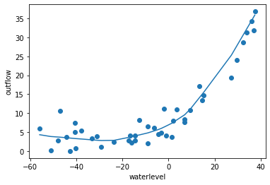
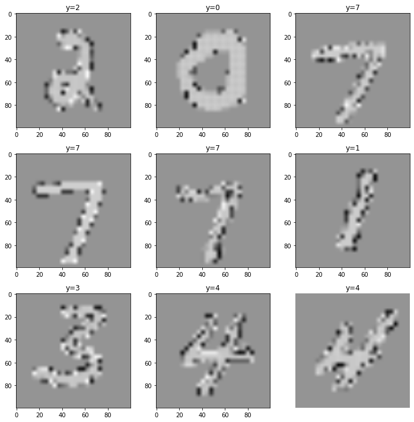
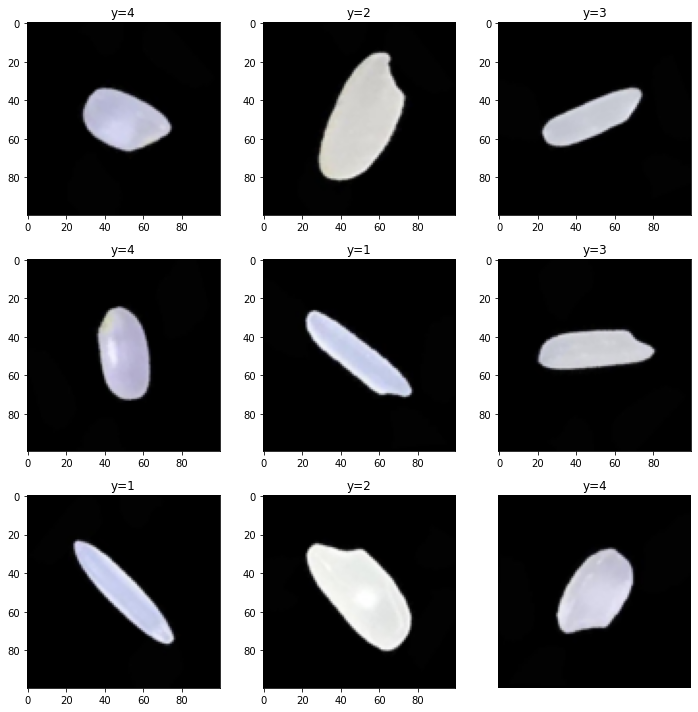

# PipeTorch Model module

The model module provides a few generic architectures, making it easy to instantiate a Multilayer Perceptron or a Convolutional Network. Regardless, often you may want to try something else, therefore, the data and train modules also work with a self-written PyTorch model.

We we cover training in the following topics:
- [Multi-layer Perceptron](#Multi-layer-Perceptron)
- [Convolutional Network](#Convolutional-Network)
- [Transfer Learning](#Transfer-Learning)

# Multi-layer Perceptron

Class that implements a generic MultiLayerPerceptron
```
Args:
    *with: int
        Sequence of at least two ints, that provide the widths for all the layers in the network.
        The first width should match the number of input features, the last width should match the
        numbetr of target variables (usually 1).

    preprocess: func (identity)
        function that will be used on the input first. The default means no preprocessing

    inner_activation: func (nn.ReLU())
        activation function that is used on all layers except the output

    drop_prob: float (None)
        if provided, Dropout layers are added in between all layers but the last, with a fixed
        dropout probability.

    last_activation: func (None)
        the activation function used on the last layer. The most common choices are None for regression
        nn.Sigmoid() for binary classification and nn.Softmax() for multi-label classification.
```


```python
from pipetorch.data import DFrame, dam_outflow
from pipetorch.model import MultiLayerPerceptron
from pipetorch.train import *
from sklearn.metrics import r2_score
from torch import nn
```

    using gpu 3


```python
df = dam_outflow()
df = df.split(0.2).scale()
db = df.to_databunch(batch_size=32)
```


```python
model = MultiLayerPerceptron(1, 100, 1)   # 6 features, 1 target, hidden layer 100
```


```python
t = Trainer(model, nn.MSELoss(), db, metrics=r2_score)
```


```python
t.train(100, 1e-2, cycle=10)
```


    Total:   0%|          | 0/6510 [00:00<?, ?it/s]


     10 0.10s trainloss=0.10533 validloss=1.07175 r2_score=0.67989 
     20 0.03s trainloss=0.08251 validloss=0.36970 r2_score=0.88958 
     30 0.03s trainloss=0.06659 validloss=0.41019 r2_score=0.87748 
     40 0.03s trainloss=0.06803 validloss=0.40998 r2_score=0.87755 
     50 0.03s trainloss=0.06536 validloss=0.42736 r2_score=0.87236 
     60 0.03s trainloss=0.06776 validloss=0.39622 r2_score=0.88166 
     70 0.03s trainloss=0.06381 validloss=0.37995 r2_score=0.88652 
     80 0.03s trainloss=0.06451 validloss=0.34347 r2_score=0.89741 
     90 0.03s trainloss=0.06447 validloss=0.39027 r2_score=0.88344 
    100 0.03s trainloss=0.06983 validloss=0.24900 r2_score=0.92563 


```python
df.train.scatter()
df.train.line(y=model)
```


    

    


# Convolutional Networks


```python
from pipetorch.model import ConvNet
from pipetorch.image import mnist
from pipetorch.train import *
from sklearn.metrics import accuracy_score
from torch import nn
```

# Data

For Image procesing there are a few standard collection: MNist and CIFAR. These are used for experiments so often, that they are included in the TorchVision library. However, processing them is not very efficient, therefore we followed the guidelines of FastMNIST (https://github.com/y0ast/pytorch-snippets/tree/main/fast_mnist) to speed up processing by 2x-3x.

These fast versions of MNist and Cifar can be obtained through the `mnist()`, `mnist3()` and `cifar()` loaders in `pipetorch.image`. The difference between mnist() and mnist3() is the number of channels (resp. 1 and 3). The first is faster the use, but the second is compatible with existing RGB models for transfer learning. 

# mnist()

An image_databunch of the mnist dataset in greyscale (shape is (1,28,28).
```
Args:
    test: bool (False)
        if True, the test set is also included in the Databunch

    valid_perc: float (0.1)
        the size of the train set that is used for validation

    root=None, transform=None, size=None, normalize=True, **kwargs
        see FastMNIST for documentation

    batch_size=64, num_workers=2
        see ImageDatabunch for documentation
    
Returns: ImageDatabunch
    An extension to a Databunch that provides additional support for images, like image normalization,
    transformation and show_batch to show an example.    
```

In all cases, through these loaders you get an ImageDatabunch that wraps PyTorch Dataloaders for the train, valid and optionally test set.

The ImageDatabunch adds some functionality such as `show_batch()`. Note that in FastMNist, the images are pre-normalized (which is also faster), therefore, the colors of the images are off, but they are still recognizable.


```python
db = mnist(download=True)
```


```python
db.show_batch()
```


    

    


# ConvNet()

Construct a Convolutional Network based on the given parameters. The networks is always built up as
a sequence of Convolutional layers, followed by a sequence of Linear layers. The number of pixels 
at the end of the convolutional layer is automatically computed, and the final layer is automatically added.
```
Args:
    *layers: int
        one or more channel sizes that are used for the convolutional layers. e.g for 
        RGB images (3 channels) that are processed by two convolutional layers of 
        resp. 32 and 64 filters, set layers to 3, 32, 64.

    size: int or (int, int) (default 224)
        the height and width of the images. When squared images are used, one number is enough.

    kernel_size: int or (int, int) (default 3)
        the height and width of the kernel used in the nn.Conv2d layers.

    stride: int or (int, int) (default 1)
        the stride used in the nn.Conv2d layers

    padding: int or (int, int) (default None)
        the padding used in de nn.Conv2d layers, None means kern_size // 2 is used

    pool_size: int or (int, int) (default 2)
        the kernel size used in nn.MaxPool2d

    pool_stride: int or (int, int) (default 2)
        the stride used in nn.MaxPool2d

    preprocess: func (None)
        a function that is called on X prior to feeding the input to the first layer.

    batchnorm: bool (False)
        if True, then nn.BatchNorm2d are added to every concolutional layer

    linear: int or [int] ([])
        the convolutional network is always finished by one or more linear layers. 
        The default adds a single linear layer, automatically computing the number of pixels 
        after the last convolutional layer, no information is needed except num_classes. 
        Alternatively, a single int adds two linear layers where the int is the hidden size. 
        Or when linear is a list, the list contains the hidden layer sizes of consecutive 
        hidden layers.

    num_classes: int (default 1)
        the number of outputs

    final_activation: func (None)
        the activation function on the ouput layer. If None and num_classes == 1, 
        binary classification is assumed and a nn.Sigmoid is added, otherwise 
        a multi-label classification is assumed and no final activation function is added. 
        You can override by providing a final activation function, or if no activation 
        is needed with num_classes==1 pass final_activation=lambda x:x
```


```python
model = ConvNet(1, 16, 32, size=28, num_classes=10)
```


```python
model
```


    ConvNet(
      (layer_2): Sequential(
        (0): Conv2d(1, 16, kernel_size=(3, 3), stride=(1, 1), padding=(1, 1))
        (1): ReLU()
        (2): MaxPool2d(kernel_size=(2, 2), stride=(2, 2), padding=0, dilation=1, ceil_mode=False)
      )
      (layer_3): Sequential(
        (0): Conv2d(16, 32, kernel_size=(3, 3), stride=(1, 1), padding=(1, 1))
        (1): ReLU()
        (2): MaxPool2d(kernel_size=(2, 2), stride=(2, 2), padding=0, dilation=1, ceil_mode=False)
      )
      (layer_4): Linear(in_features=1568, out_features=10, bias=True)
    )


```python
t = Trainer(model, nn.CrossEntropyLoss(), db, metrics=accuracy_score, gpu=True)
```


```python
t.train(10, lr=(3e-3, 3e-2))
```


    Total:   0%|          | 0/600320 [00:00<?, ?it/s]


     1 8.44s trainloss=0.57898 validloss=0.12983 accuracy_score=0.96217 


    ---------------------------------------------------------------------------

    IndexError                                Traceback (most recent call last)

    /opt/jupyterhub/anaconda/envs/testpt/lib/python3.9/site-packages/pipetorch-0.1a8-py3.9.egg/pipetorch/train/trainer.py in train(self, epochs, lr, cycle, save, optimizer, optimizer_params, scheduler, scheduler_params, weight_decay, momentum, save_lowest, save_highest, silent, pbar, targetloss, earlystop, log, test)
       1334                         # TODO naam aanpassen
    -> 1335                         y_pred = model.post_forward(y_pred)
       1336                     except: pass


    /opt/jupyterhub/anaconda/envs/testpt/lib/python3.9/site-packages/pipetorch-0.1a8-py3.9.egg/pipetorch/model/convnet.py in <lambda>(y)
        130             else:
    --> 131                 self.post_forward = lambda y:torch.argmax(y, axis=1)
        132         else:


    IndexError: Dimension out of range (expected to be in range of [-1, 0], but got 1)

    
    During handling of the above exception, another exception occurred:


    KeyboardInterrupt                         Traceback (most recent call last)

    /tmp/ipykernel_29188/4024199145.py in <module>
    ----> 1 t.train(10, lr=(3e-3, 3e-2))
    

    /opt/jupyterhub/anaconda/envs/testpt/lib/python3.9/site-packages/pipetorch-0.1a8-py3.9.egg/pipetorch/train/trainer.py in train(self, epochs, lr, cycle, save, optimizer, optimizer_params, scheduler, scheduler_params, weight_decay, momentum, save_lowest, save_highest, silent, pbar, targetloss, earlystop, log, test)
       1333                     try:
       1334                         # TODO naam aanpassen
    -> 1335                         y_pred = model.post_forward(y_pred)
       1336                     except: pass
       1337                     if report:


    KeyboardInterrupt: 


```python
t.curves()
```

# ConvNet

As second example is for training a ConvNet on a Kaggle Dataset, with data augmentation.


```python
from pipetorch.model import ConvNet, Transfer
from pipetorch.image import ImageDFrame
from pipetorch.train import *
from sklearn.metrics import accuracy_score
from torchvision.models import resnet34
from torchvision import transforms
from torch import nn
```

    using gpu 3


In this case, we will load a Kaggle image dataset with a class-folder structure using Torchvisions's ImageFolder. The filename 'Rice_Image_Dataset' indicates the root folder of the image collection. Below this folder there are folders with the names of class labels. The ImageDFrame is an extension of a PipeTorch DataFrame that initially holds the filenames and class numbers of the images.


```python
df = ImageDFrame.read_from_kaggle('muratkokludataset/rice-image-dataset', 'Rice_Image_Dataset')
```


```python
df.classes
```


    ['Arborio', 'Basmati', 'Ipsala', 'Jasmine', 'Karacadag']


```python
df[:5]
```


<div>
<style scoped>
    .dataframe tbody tr th:only-of-type {
        vertical-align: middle;
    }

    .dataframe tbody tr th {
        vertical-align: top;
    }

    .dataframe thead th {
        text-align: right;
    }
</style>
<table border="1" class="dataframe">
  <thead>
    <tr style="text-align: right;">
      <th></th>
      <th>filename</th>
      <th>target</th>
    </tr>
  </thead>
  <tbody>
    <tr>
      <th>0</th>
      <td>/home/jeroen/.pipetorchuser/rice-image-dataset...</td>
      <td>0</td>
    </tr>
    <tr>
      <th>1</th>
      <td>/home/jeroen/.pipetorchuser/rice-image-dataset...</td>
      <td>0</td>
    </tr>
    <tr>
      <th>2</th>
      <td>/home/jeroen/.pipetorchuser/rice-image-dataset...</td>
      <td>0</td>
    </tr>
    <tr>
      <th>3</th>
      <td>/home/jeroen/.pipetorchuser/rice-image-dataset...</td>
      <td>0</td>
    </tr>
    <tr>
      <th>4</th>
      <td>/home/jeroen/.pipetorchuser/rice-image-dataset...</td>
      <td>0</td>
    </tr>
  </tbody>
</table>
</div>


Most specifically for images, we can also normalize the images (which we did not do here, because it does not seem to matter on this dataset) and apply transformations from torchvision. The original images are 250x250 pixels, which we choose the resize to 224x224 because that makes it easier to process with a ConvNet.


```python
df = df.split(0.02, shuffle=True).normalize(False)
df = df.transforms(
    transforms.RandomRotation(45),
    transforms.Resize(224),
    transforms.RandomHorizontalFlip(),
    transforms.RandomVerticalFlip()
)

db = df.to_databunch()
```

We can show a batch to get an impression. These are 250x250 pixel images of rice grains and the objective is te recognize what type of rice grain these are.


```python
db.show_batch()
```


    

    


We can fit a standard ConvNet. We have to specify the image dimensions in `size`, the first channel size has to be `3` because these are RGB images, and `num_classes=5` because there are 5 classes.


```python
model = ConvNet(3, 16, 32, linear=100, num_classes=5, size=224)
```

Create a trainer as normal. Do not forget to turn the GPU on, it matters.


```python
t = Trainer(model, nn.CrossEntropyLoss(), db, metrics=accuracy_score, num_workers=2, gpu=True)
```

Because of the size of this dataset (75k), we may choose to validate every 1/10 epoch, so that we receive an early indication whether the model is training as expected. We also lowered the validation percentage (0.02) to reduce the overhead of running validation, at least during hyperparameter tuning. You may decide to raise the the validation percentage after the model is close to optimally tuned.

You will probably already see a 99.5% accuracy. The upper bound seems to be around 99.7% using a new ConvNet.


```python
t.train(3, (1e-3, 1e-2), cycle=1/10)
```


    Total:   0%|          | 0/265632 [00:00<?, ?it/s]


    ---------------------------------------------------------------------------

    KeyboardInterrupt                         Traceback (most recent call last)

    /tmp/ipykernel_47268/2188383751.py in <module>
    ----> 1 t.train(3, (1e-3, 1e-2), cycle=1/10)
    

    /opt/jupyterhub/anaconda/envs/testpt/lib/python3.9/site-packages/pipetorch-0.1a8-py3.9.egg/pipetorch/train/trainer.py in train(self, epochs, lr, cycle, save, optimizer, optimizer_params, scheduler, scheduler_params, weight_decay, momentum, save_lowest, save_highest, silent, pbar, targetloss, earlystop, log, test)
       1339             log_this_epoch = self.epochid == log_next_epoch
       1340             with self.train_mode:
    -> 1341                 for batch, (*X, y) in enumerate(self.train_Xy):
       1342                     #print(self.cycle, len(self.train_dl), batch, log_batches, log_next_epoch, log_this_epoch)
       1343                     if self.scheduler._step_count == self.scheduler.total_steps:


    /opt/jupyterhub/anaconda/envs/testpt/lib/python3.9/site-packages/pipetorch-0.1a8-py3.9.egg/pipetorch/train/trainer.py in train_Xy(self)
        594     @property
        595     def train_Xy(self):
    --> 596         for batch in self.train_dl:
        597             yield [ t.to(self.model.device) for t in batch ]
        598 


    /opt/jupyterhub/anaconda/envs/testpt/lib/python3.9/site-packages/torch/utils/data/dataloader.py in __next__(self)
        519             if self._sampler_iter is None:
        520                 self._reset()
    --> 521             data = self._next_data()
        522             self._num_yielded += 1
        523             if self._dataset_kind == _DatasetKind.Iterable and \


    /opt/jupyterhub/anaconda/envs/testpt/lib/python3.9/site-packages/torch/utils/data/dataloader.py in _next_data(self)
        559     def _next_data(self):
        560         index = self._next_index()  # may raise StopIteration
    --> 561         data = self._dataset_fetcher.fetch(index)  # may raise StopIteration
        562         if self._pin_memory:
        563             data = _utils.pin_memory.pin_memory(data)


    /opt/jupyterhub/anaconda/envs/testpt/lib/python3.9/site-packages/torch/utils/data/_utils/fetch.py in fetch(self, possibly_batched_index)
         47     def fetch(self, possibly_batched_index):
         48         if self.auto_collation:
    ---> 49             data = [self.dataset[idx] for idx in possibly_batched_index]
         50         else:
         51             data = self.dataset[possibly_batched_index]


    /opt/jupyterhub/anaconda/envs/testpt/lib/python3.9/site-packages/torch/utils/data/_utils/fetch.py in <listcomp>(.0)
         47     def fetch(self, possibly_batched_index):
         48         if self.auto_collation:
    ---> 49             data = [self.dataset[idx] for idx in possibly_batched_index]
         50         else:
         51             data = self.dataset[possibly_batched_index]


    /opt/jupyterhub/anaconda/envs/testpt/lib/python3.9/site-packages/pipetorch-0.1a8-py3.9.egg/pipetorch/data/transformabledataset.py in __getitem__(self, index)
         52                 x, y = t(x, y)
         53             else:
    ---> 54                 x = t(x)
         55         if self._dtype is None or not np.issubdtype(self._dtype, np.number):
         56             x = x.type(torch.FloatTensor)


    /opt/jupyterhub/anaconda/envs/testpt/lib/python3.9/site-packages/torchvision/transforms/transforms.py in __call__(self, pic)
         96             Tensor: Converted image.
         97         """
    ---> 98         return F.to_tensor(pic)
         99 
        100     def __repr__(self):


    /opt/jupyterhub/anaconda/envs/testpt/lib/python3.9/site-packages/torchvision/transforms/functional.py in to_tensor(pic)
        148     img = img.permute((2, 0, 1)).contiguous()
        149     if isinstance(img, torch.ByteTensor):
    --> 150         return img.to(dtype=default_float_dtype).div(255)
        151     else:
        152         return img


    KeyboardInterrupt: 


# Transfer Learning

Often, the amount of available data is limited, forcing us to simplify the model used (to avoid overfitting). The downside of a simple model is that a limited amount of useful representations will be recognized. We can often overcome this by applying transfer learning.

To make transfer learning easier, there is a `Transfer` class in `pipetorch.models`. This can be instantiated with a pretrained model, for example from `torchvision.models`. The standard approach to transfer learning is to replace the final layer with a Linear and the given number of output nodes. Then we train the model in two phases: 
- (1) freeze the weights of the pretrained model and train the newly created final layer on the dataset, 
- (2) unfreeze the weights and finetune all the weights. 

During phase (1) we can train more aggresively with a higher learning rate, since overfitting is not that much of an issue learning weights in a single layer. During phase (2), we should be very careful not to overfit the network and therefore use a tiny (cyclic) learning rate. In general, cyclic learning rates tend to find wider local optima, and therefore may provide a slightly more stable training.


```python
from pipetorch.model import Transfer
from pipetorch.image import ImageDFrame
from pipetorch.train import *
from sklearn.metrics import accuracy_score
from torchvision.models import resnet34
from torchvision import transforms
from torch import nn
```


```python
df = ImageDFrame.read_from_kaggle('muratkokludataset/rice-image-dataset', 'Rice_Image_Dataset')
```

We will use the same setup as for training a ConvNet, to compare the two.


```python
df = df.split(0.02, shuffle=True).normalize(False)
df = df.transforms(
    transforms.RandomRotation(45),
    transforms.Resize(224),
    transforms.RandomHorizontalFlip(),
    transforms.RandomVerticalFlip()
)

db = df.to_databunch()
```


```python
model = Transfer(model=resnet34, output_nodes=5)
```


```python
model.freeze()
```


```python
t = Trainer(model, nn.CrossEntropyLoss(), db, metrics=accuracy_score, num_workers=2, gpu=True)
```


```python
t.train(1, (3e-3, 3e-2), cycle=1/10, save_lowest=True)
```


    Total:   0%|          | 0/88544 [00:00<?, ?it/s]


    1.10 38.06s trainloss=0.51455 validloss=0.19454 accuracy_score=0.94467 
    1.20 37.04s trainloss=0.21023 validloss=0.13989 accuracy_score=0.95933 
    1.30 39.55s trainloss=0.16328 validloss=0.12386 accuracy_score=0.95933 
    1.40 37.92s trainloss=0.15259 validloss=0.10875 accuracy_score=0.96333 
    1.50 39.08s trainloss=0.12875 validloss=0.09241 accuracy_score=0.97067 
    1.60 43.90s trainloss=0.13641 validloss=0.09369 accuracy_score=0.97133 
    1.70 38.89s trainloss=0.13713 validloss=0.08583 accuracy_score=0.97200 


```python
# revert to the version with the lowest validation loss
t.lowest()
```


```python
model.unfreeze()
```


```python
t.train(2, (3e-6, 3e-5), cycle=1/10)
```


```python

```
